# **LAMP en dos niveles**
#### Marcos de la Marta Núñez

 
 

 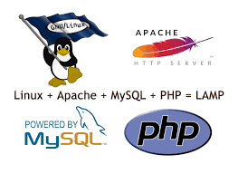

  
 
 
 

# Índice

1. [**LAMP en dos niveles**](#lamp-en-dos-niveles)
    - [1.1 Creación y configuración de las máquinas](#creación-y-configuración-de-las-máquinas)
        - [1.1.1 Vagrantfile de las dos máquinas](#vagrantfile-de-las-dos-máquinas)
        - [1.1.2 Scripts de aprovisionamiento](#scripts-de-aprovisionamiento)
            - [1.1.2.1 Script para el servidor Apache](#script-para-el-servidor-apache)
            - [1.1.2.2 Script para el servidor MySQL](#script-para-el-servidor-mysql)
    - [1.2 Configuración del servidor MySQL](#configuración-servidor-mysql)
        - [1.2.1 Clonar la carpeta de GitHub en la máquina SQL](#clonar-la-carpeta-de-github-en-la-máquina-sql)
        - [1.2.2 Modificar el fichero 50-server.cnf](#modificar-el-fichero-50-server.cnf)
        - [1.2.3 Ejecutar el Script SQL](#ejecutar-el-script-sql)
        - [1.2.4 Crear un usuario de MySQL con la IP del servidor Apache](#crear-un-usuario-de-mysql-con-la-ip-del-servidor-apache)
    - [1.3 Configuración del servidor Apache](#configuración-servidor-apache)
        - [1.3.1 Mover archivos a /var/www](#mover-archivos-a-varwww)
        - [1.3.2 Crear un fichero de configuración en sites-available](#crear-un-fichero-de-configuración-en-sites-available)
        - [1.3.3 Editar el fichero de configuración](#editar-el-fichero-de-configuración)
        - [1.3.4 Habilitar el fichero de configuración](#habilitar-el-fichero-de-configuración)
        - [1.3.5 Desactivar el fichero de configuración](#desactivar-el-fichero-de-configuración)
        - [1.3.6 Editar el archivo config.php](#editar-el-archivo-config.php)
        - [1.3.7 Ingresar al servidor MySQL desde el servidor Apache](#ingresar-al-servidor-mysql-desde-el-servidor-apache)
        - [1.3.8 Verificar el resultado](#verificar-el-resultado)
 
 
 
 
 
 
 

## **1. Creación y configuración de las máquinas.**
 
 

### Creamos dos máquinas en Vagrant, una para el servidor de Apache y otra para MySQL.
#### Vagrantfile de las dos máquinas.
 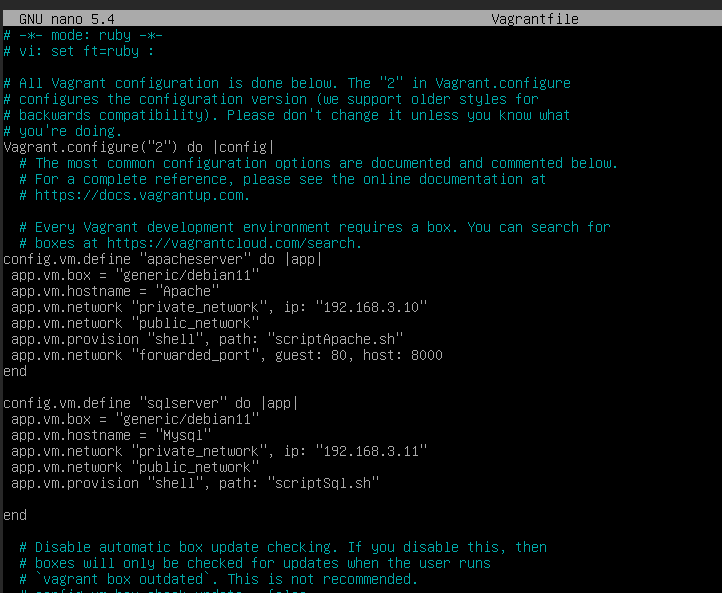

### Creamos un par de scripts de aprovisionamiento para facilitar la configuración de las máquinas.

#### Script para el servidor Apache.
 

#### Script para el servidor MySQL.
 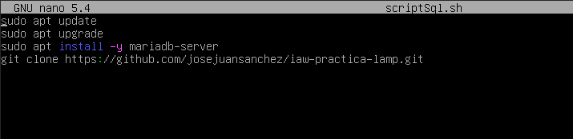
 
 
 

## **2. Configuración servidor MySQL.**
  
 

### Clonamos la carpeta de GitHub en nuestra máquina SQL.
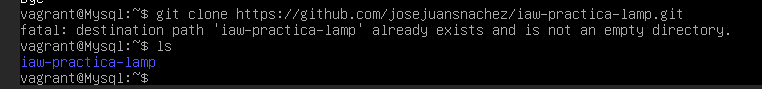
### Nos dirigimos al directorio */etc/mysql/mariadb.conf.d* y modificamos el fichero *50-server.cnf*, cambiamos la *bind-address* y ponemos la IP de nuestra máquina.
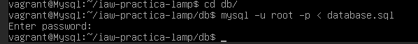
### Ejecutamos el Script SQL en nuestro servidor.
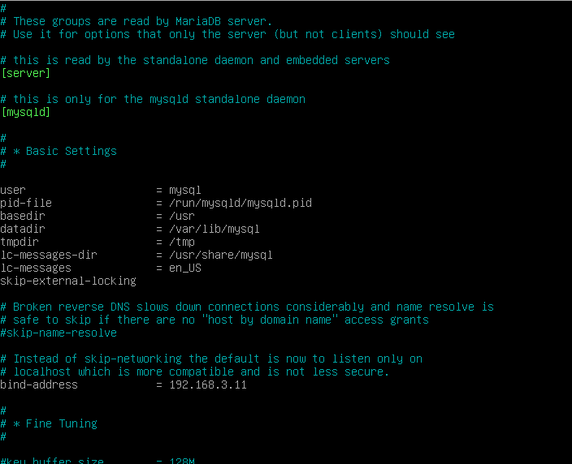
### Después creamos un usuario de MySQL pero con la IP de nuestro servidor Apache.
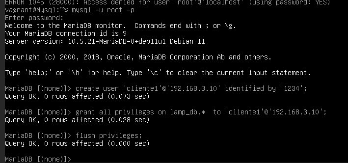
 
 
 
 
 
 

## **3. Configuración servidor Apache.**
 
 

### Nos dirigimos al directorio */var/www*, movemos los archivos src de la carpeta de GitHub.
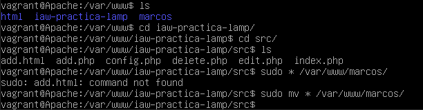

### Ahora nos vamos a la carpeta de sites-available en */etc/apache2/sites-available* y creamos un fichero de configuración.
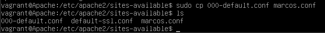

### Editamos el fichero de configuración y ponemos la ruta de la carpeta que hemos creado anteriormente.

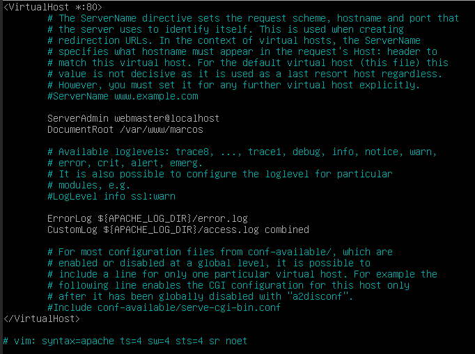

### A continuación habilitamos el fichero de configuración que hemos creado con a2ensite.
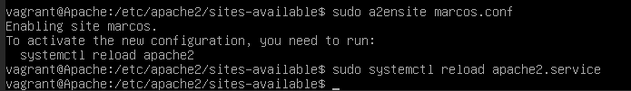

### Ahora nos dirigimos a */etc/apache2/sites-enabled* y desactivamos el fichero de configuración anterior con **a2dissite**. Después de esto, recargamos el Apache2 con **sudo systemctl reload apache2**.
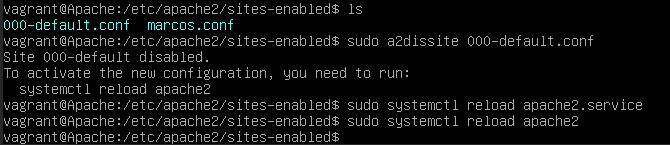

### Lo siguiente es entrar en la carpeta creada en */var/www* y editar el fichero config.php, donde pone localhost, ponemos la IP de la máquina de MySQL y cambiamos los datos de usuario y contraseña.
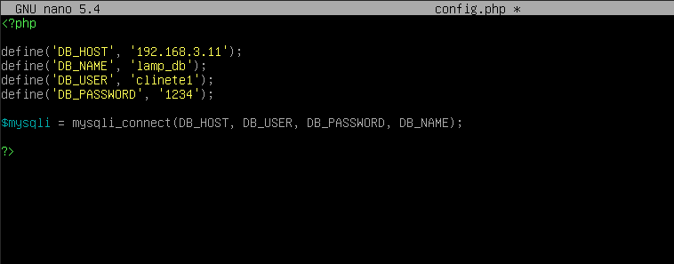

### Ahora en el servidor Apache, ingresamos al servidor MySQL con el siguiente comando: **mysql -u nombreusuario -p -h ipmysql**.
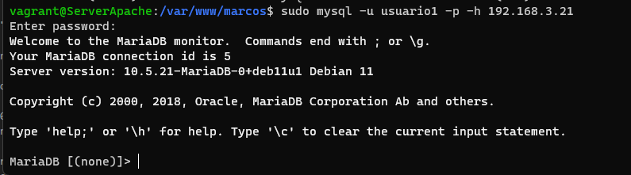
### Ahora, si ponemos la dirección de la máquina de Apache en Google, veremos la página del LAMP.
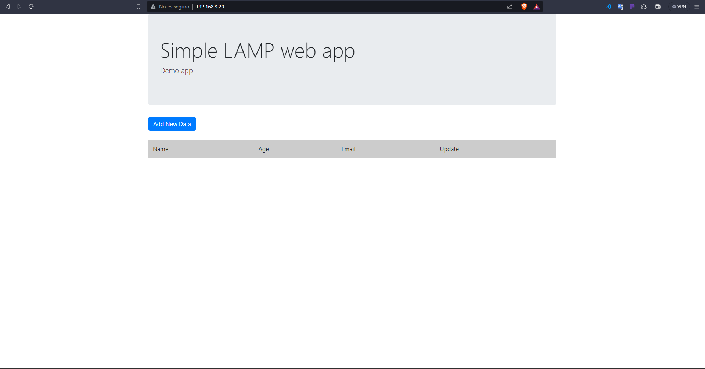
