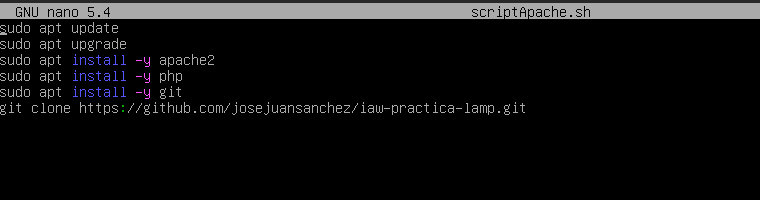

# **Lamp-en-dos-niveles**
 
 

## **1. Creación y configuracion de las maquinas.**
 
 

### Creamos dos maquina en Vagrant una para el servidor de Apache y otra para el Mysql
#### Vagrantfile de las dos maquinas.
 

### Creamos un par de scripts de aprovisionamientopara facilitar la configuracion de las maquinas.

#### Script para el servidor Apache.
 

#### Script para servidor SQL.
 
 
 
 

## **2. Configuracion servidor SQL.**
  
 

### Clonamos la carpeta de github a nuestra maquina sql

### Nos vamos directorio */etc/mysql/mariadb.conf.d* y modificamos el fichero *50-server.cnf* cambiamos la *bind-address* y ponemos la ip de nuestra maquina.

### Ejecutamos el Script sql en nuestro servidor.

### Despues creamos un usuario mysql pero con la ip de nuestro servidor apache.

 
 
 
 
 
 

## **3. Configuracion servidor Apache.**
 
 

### Nos dirigimos al directorio */var/www* movemos los archivos src de la carpeta de github.

### Ahora nos vamos a la carpeta de sites-available en */etc/apache2/sites-availables* y creamos un fichero de configuración.

### Editamos el fichero de configuración y ponemos la ruta de la carpeta que hemos craddo anteriormente

### Acontinuación habilitamos el fichero de configuración que hemos creado con a2ensite.

### ### Ahora nos vamos a */etc/apache2/sites-enabled* y desactivamos el fichero de configuración anterior con **a2dissite**. Despues de esto recargamos el apache2 con **sudo systemctl reload apache2**.

### Lo siguiente es entrar en la carpeta creada en */var/www* y editar el fichero config.php y donde pone localhost ponemos la ip de la maquina de sql y cambiamos los datos de user y password.

### Ahora en el servidor apache entramos a servidor mysql con el siguiente comando **mysql -u nombreusuario -p -h ipmysql**.
